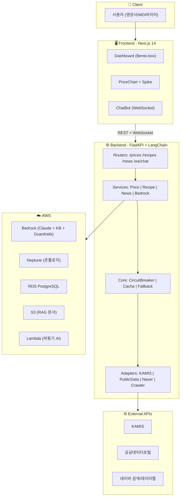
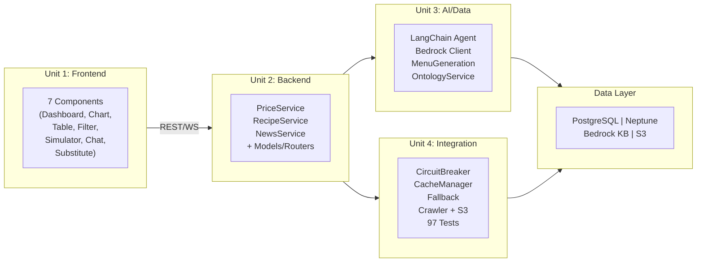

# 🍽️ 식견(食見) - FoodLens

> **MD/영양사/바이어 전용 AI 대시보드 & 챗봇 시스템**
>
> 농수산물·원자재·식자재 가격 데이터와 뉴스를 결합하여 급식 메뉴 단가를 최적화하는 서비스

[](https://aws.amazon.com)
[](https://nextjs.org)
[](https://fastapi.tiangolo.com)
[](https://langchain.com)

---

## 📋 프로젝트 개요

**식견(食見)** 은 "식자재를 보는 눈" + "식견(識見, 안목)"의 중의적 표현으로, 식자재 시장의 가격 동향을 AI로 분석하고 최적의 의사결정을 지원하는 플랫폼입니다.

### 대상 사용자
| 페르소나 | 역할 | 핵심 니즈 |
|----------|------|-----------|
| 🧑‍🍳 영양사 | 급식 메뉴 계획 | 예산 내 영양 균형 메뉴, 대체 식자재 |
| 📊 MD | 전략 상품 기획 | 시세 분석, 매입가 결정 근거 |
| 🛒 바이어 | 대량 구매 | 최적 구매 시점, 가격 예측 |

---

## ✨ 핵심 기능

### 1. 식자재 분류 체계 대시보드
- 농산물/수산물/축산물/가공식품 카테고리별 필터링
- 도매가/소매가/시세 갭(Gap) 분석
- Bento-box 레이아웃의 모던 UI

### 2. 시세 추이 그래프 + 가격 이상치(Spike) 뉴스 매핑
- Recharts 기반 인터랙티브 차트
- Z-Score 알고리즘으로 가격 이상치 자동 감지
- Spike 시점 마우스 오버 → 관련 뉴스 헤드라인 표시

### 3. AI 기반 메뉴/레시피 제안 + 식수별 비용 시뮬레이션
- 100식~10,000식 규모별 원가 계산
- 예산 제약 내 영양 균형 메뉴 AI 추천
- 재료별 단가 분석 및 비교

### 4. 대체 식자재 원가 절감 전략
- 온톨로지(지식 그래프) 기반 대체 식자재 추천
- 가격 비교 + 절감률 시뮬레이션
- 영양 유사도/조리 호환성 기반 추천

### 5. 대화형 AI 챗봇 (RAG 기반)
- Amazon Bedrock Knowledge Bases + LangChain Agent
- 컨설턴트 스타일 응답 (분석 → 추천 → 근거)
- 실시간 스트리밍 + 타이핑 애니메이션
- 데이터 출처 명시 + 신뢰도 표시

### 6. 뉴스 크롤링 & 시세 이벤트 연동
- 네이버 뉴스 API + 정부 보도자료 자동 수집
- 식자재 키워드 분류 + 시세 변동 시점 매핑
- RAG Knowledge Base 자동 적재

---

## 🏗️ 시스템 아키텍처

> 상세 아키텍처 다이어그램: `docs/architecture-diagram.html` (브라우저에서 열기)
> 서비스 구성도: `docs/service-components-diagram.html` (브라우저에서 열기)



### 서비스 구성도



---

## 🛠️ 기술 스택

| 레이어 | 기술 |
|--------|------|
| **Frontend** | Next.js 14, React 18, TypeScript, Tailwind CSS, Recharts, Zustand |
| **Backend** | Python 3.11+, FastAPI, Pydantic, SQLAlchemy, LangChain |
| **AI/LLM** | Amazon Bedrock (Claude 3.5 Sonnet), Knowledge Bases, Guardrails |
| **Graph DB** | Amazon Neptune (Gremlin) |
| **RDB** | Amazon RDS PostgreSQL 15 |
| **Storage** | Amazon S3 |
| **Infra** | Docker Compose (시연), ECS Fargate + CloudFront (프로덕션 설계) |
| **Data Sources** | KAMIS API, 공공데이터포털, 네이버 검색/데이터랩 API |
| **Testing** | pytest, Hypothesis (PBT), fast-check |

---

## 🚀 빠른 시작

### 사전 요구사항
- Node.js 18+
- Python 3.11+
- Docker & Docker Compose
- AWS 자격증명 (Bedrock, Neptune 접근용)

### 1. 환경 설정
```bash
git clone https://github.com/shk1m/AI-DLC.git
cd AI-DLC
cp .env.example .env
# .env 파일에 AWS 자격증명, API 키 입력
```

### 2. 인프라 시작 (PostgreSQL + Redis)
```bash
docker-compose up -d
```

### 3. 백엔드 시작
```bash
cd backend
pip install -r requirements.txt
alembic upgrade head
uvicorn app.main:app --reload --port 8000
```

### 4. 프론트엔드 시작
```bash
cd frontend
npm install
npm run dev
```

### 5. 브라우저 접속
```
http://localhost:3000
```

---

## 📁 프로젝트 구조

```
AI-DLC/
├── frontend/           # Next.js 14 대시보드 (Unit 1)
├── backend/            # FastAPI + LangChain (Unit 2, 3, 4)
│   ├── app/
│   │   ├── routers/    # API 엔드포인트
│   │   ├── services/   # 비즈니스 로직 + AI
│   │   ├── models/     # SQLAlchemy 모델
│   │   ├── schemas/    # Pydantic DTO
│   │   ├── adapters/   # 외부 API + 크롤러
│   │   └── core/       # Cross-cutting (캐시, 회로차단기, 로깅)
│   ├── scripts/        # 데이터 적재 스크립트
│   └── tests/          # 단위 + PBT 테스트
├── data/               # 온톨로지 + 뉴스 샘플 데이터
├── docker-compose.yml  # 로컬 인프라
└── aidlc-docs/         # AI-DLC 방법론 산출물
```

---

## 📊 데이터 소스

| 데이터 | 소스 | 용도 |
|--------|------|------|
| 농산물 시세 | KAMIS API | 도소매 가격 추이 |
| 수산물 시세 | 해양수산부 API | 위판장/소매 가격 |
| 축산물 시세 | EKAPEPIA API | 도매/소매 가격 |
| 가공식품 가격 | 공공데이터포털 | 소매 가격 |
| 실시간 경매 | 공공데이터포털 | 도매시장 경매 |
| 뉴스 | 네이버 검색 API | 시세 이벤트 매핑 |
| 검색 트렌드 | 네이버 데이터랩 | 시장 동향 모니터링 |
| 정부 보도자료 | 농림축산식품부/해양수산부 | 정책/수급 뉴스 |

---

## 💰 비즈니스 모델

| 플랜 | 대상 | 기능 |
|------|------|------|
| Basic | 소규모 급식소 | 시세 조회, 기본 레시피 |
| Pro | 중규모 급식업체 | AI 추천, 시뮬레이션, 알림 |
| Enterprise | 대형 유통/급식 | 전체 기능, API, 커스텀 온톨로지 |

---

## 🧪 테스트

```bash
cd backend
pytest                          # 전체 테스트
pytest tests/unit/              # 단위 테스트
pytest --hypothesis-show-statistics  # PBT 통계
```

---

## 👥 팀 구성

| 역할 | 담당 | Unit |
|------|------|------|
| Frontend | 팀원 A | Unit 1: Next.js 대시보드 |
| Backend | 팀원 B | Unit 2: FastAPI 서버 |
| AI/Data | 팀원 C | Unit 3: Bedrock + Lambda |
| Integration | 팀원 D | Unit 4: Cross-cutting + 시연 |

---

## 📄 AI-DLC 산출물

이 프로젝트는 **AI-DLC (AI-Driven Development Life Cycle)** 방법론을 활용하여 개발되었습니다.

```
aidlc-docs/
├── inception/
│   ├── requirements/           # 요구사항 분석
│   ├── user-stories/           # 유저 스토리 + 페르소나
│   ├── plans/                  # 실행 계획
│   └── application-design/     # 애플리케이션 설계
├── construction/
│   ├── all-units/              # 기능설계, NFR, 인프라
│   ├── plans/                  # 코드 생성 계획
│   └── unit-4-integration/     # Unit 4 구현 요약
├── aidlc-state.md              # 워크플로우 상태 추적
└── audit.md                    # 전체 감사 로그
```

---

## 📜 라이선스

이 프로젝트는 사내 해커톤 대회를 위해 개발되었습니다.
