# Execution Plan

## Detailed Analysis Summary

### Change Impact Assessment
- **User-facing changes**: Yes - 완전히 새로운 대시보드 + 챗봇 시스템
- **Structural changes**: Yes - 전체 시스템 아키텍처 신규 설계
- **Data model changes**: Yes - 온톨로지, 시세 데이터, 뉴스 이벤트 모델 신규
- **API changes**: Yes - 전체 API 신규 설계 (FastAPI + LangChain)
- **NFR impact**: Yes - 성능, 보안, 확장성 모두 해당

### Risk Assessment
- **Risk Level**: Medium (해커톤 환경이므로 시간 제약이 주요 리스크)
- **Rollback Complexity**: Easy (Greenfield, 롤백 불필요)
- **Testing Complexity**: Moderate (다중 외부 API 의존, AI 응답 품질)

---

## Workflow Visualization

```mermaid
flowchart TD
    Start(["User Request"])
    
    subgraph INCEPTION["INCEPTION PHASE"]
        WD["Workspace Detection<br/>COMPLETED"]
        RA["Requirements Analysis<br/>COMPLETED"]
        US["User Stories<br/>COMPLETED"]
        WP["Workflow Planning<br/>COMPLETED"]
        AD["Application Design<br/>EXECUTE"]
        UG["Units Generation<br/>EXECUTE"]
    end
    
    subgraph CONSTRUCTION["CONSTRUCTION PHASE"]
        FD["Functional Design<br/>EXECUTE"]
        NFRA["NFR Requirements<br/>EXECUTE"]
        NFRD["NFR Design<br/>EXECUTE"]
        ID["Infrastructure Design<br/>EXECUTE"]
        CG["Code Generation<br/>EXECUTE"]
        BT["Build and Test<br/>EXECUTE"]
    end
    
    Start --> WD
    WD --> RA
    RA --> US
    US --> WP
    WP --> AD
    AD --> UG
    UG --> FD
    FD --> NFRA
    NFRA --> NFRD
    NFRD --> ID
    ID --> CG
    CG --> BT
    BT --> End(["Complete"])

    style WD fill:#4CAF50,stroke:#1B5E20,stroke-width:3px,color:#fff
    style RA fill:#4CAF50,stroke:#1B5E20,stroke-width:3px,color:#fff
    style US fill:#4CAF50,stroke:#1B5E20,stroke-width:3px,color:#fff
    style WP fill:#4CAF50,stroke:#1B5E20,stroke-width:3px,color:#fff
    style AD fill:#FFA726,stroke:#E65100,stroke-width:3px,stroke-dasharray: 5 5,color:#000
    style UG fill:#FFA726,stroke:#E65100,stroke-width:3px,stroke-dasharray: 5 5,color:#000
    style FD fill:#FFA726,stroke:#E65100,stroke-width:3px,stroke-dasharray: 5 5,color:#000
    style NFRA fill:#FFA726,stroke:#E65100,stroke-width:3px,stroke-dasharray: 5 5,color:#000
    style NFRD fill:#FFA726,stroke:#E65100,stroke-width:3px,stroke-dasharray: 5 5,color:#000
    style ID fill:#FFA726,stroke:#E65100,stroke-width:3px,stroke-dasharray: 5 5,color:#000
    style CG fill:#4CAF50,stroke:#1B5E20,stroke-width:3px,color:#fff
    style BT fill:#4CAF50,stroke:#1B5E20,stroke-width:3px,color:#fff
    style Start fill:#CE93D8,stroke:#6A1B9A,stroke-width:3px,color:#000
    style End fill:#CE93D8,stroke:#6A1B9A,stroke-width:3px,color:#000
    style INCEPTION fill:#BBDEFB,stroke:#1565C0,stroke-width:3px,color:#000
    style CONSTRUCTION fill:#C8E6C9,stroke:#2E7D32,stroke-width:3px,color:#000

    linkStyle default stroke:#333,stroke-width:2px
```



### Text Alternative
```
Phase 1: INCEPTION
- Workspace Detection (COMPLETED)
- Requirements Analysis (COMPLETED)
- User Stories (COMPLETED)
- Workflow Planning (COMPLETED)
- Application Design (EXECUTE)
- Units Generation (EXECUTE)

Phase 2: CONSTRUCTION
- Functional Design (EXECUTE)
- NFR Requirements (EXECUTE)
- NFR Design (EXECUTE)
- Infrastructure Design (EXECUTE)
- Code Generation (EXECUTE)
- Build and Test (EXECUTE)
```

---

## Phases to Execute

### INCEPTION PHASE
- [x] Workspace Detection (COMPLETED)
- [x] Reverse Engineering (SKIPPED - Greenfield)
- [x] Requirements Analysis (COMPLETED)
- [x] User Stories (COMPLETED)
- [x] Workflow Planning (IN PROGRESS)
- [ ] Application Design - EXECUTE
  - **Rationale**: 신규 시스템으로 컴포넌트 식별, 서비스 레이어 설계, 컴포넌트 간 의존성 정의 필요
- [ ] Units Generation - EXECUTE
  - **Rationale**: 7개 Epic을 병렬 개발 가능한 단위로 분해 필요 (4명 팀원 역할 분담)

### CONSTRUCTION PHASE
- [ ] Functional Design - EXECUTE
  - **Rationale**: 온톨로지 스키마, 가격 계산 로직, Spike 감지 알고리즘 등 복잡한 비즈니스 로직 설계 필요
- [ ] NFR Requirements - EXECUTE
  - **Rationale**: 보안(SECURITY-01~15), PBT(PBT-01~10), 성능 요구사항 구체화 필요
- [ ] NFR Design - EXECUTE
  - **Rationale**: NFR 패턴을 실제 아키텍처에 반영하는 설계 필요
- [ ] Infrastructure Design - EXECUTE
  - **Rationale**: AWS 서비스 매핑 (Neptune, Bedrock, RDS, Lambda 등) 구체화 필요
- [ ] Code Generation - EXECUTE (ALWAYS)
  - **Rationale**: 실제 코드 생성 (Next.js + FastAPI + LangChain)
- [ ] Build and Test - EXECUTE (ALWAYS)
  - **Rationale**: 빌드 및 테스트 지침 생성

### OPERATIONS PHASE
- [ ] Operations - PLACEHOLDER
  - **Rationale**: 향후 배포/모니터링 워크플로우 (현재 미구현)

---

## Estimated Timeline
- **Total Stages to Execute**: 8개 (Application Design → Build and Test)
- **Estimated Duration**: AI-DLC 문서 작업 기준 약 2~3시간
- **해커톤 실제 개발**: 타임테이블에 따라 병렬 진행

## Success Criteria
- **Primary Goal**: 6시간 내 시연 가능한 Product 수준 서비스 완성
- **Key Deliverables**:
  - Next.js 14 대시보드 (Bento-box, Recharts, 챗봇)
  - FastAPI + LangChain 백엔드
  - Amazon Bedrock RAG 챗봇
  - Neptune 온톨로지
  - 뉴스 크롤링 파이프라인
- **Quality Gates**:
  - 대시보드 로딩 3초 이내
  - 챗봇 응답 5초 이내
  - 모든 API 입력 검증 (SECURITY-05)
  - PBT 프레임워크 설정 완료 (PBT-09)
